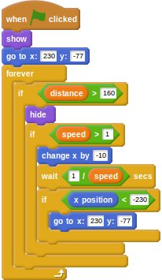

# The Scratch Olympics Hurdler

Now that you have made the basic game by following the first [worksheet](worksheet.md), you can tweak it and add some extra elements to improve the playability of the game and make it a little bit more fun.

## Hiding the hurdles.

You may have noticed that the hurdles stay on the screen, even when the player is approaching the finishing line. A little change to some of the scripts and the game can be made a little bit more realistic.

1. The first thing to do is to hide the hurdles when the `distance` variable climbs above a certain value. Click on the hurdles sprite you have imported and then alter the script to include a conditional to check for this. You'll also need to add in a `show` when the script is started.

<!--
``` scratch
	when green flag clicked
	show
	go to x: [230] y:[-77]
	forever
	if <(distance) > [160]>
	hide
	if <(speed) > [1]>
	change x by [-10]
	wait <[1]/(speed)> secs
	if <(x position) < [-230]>
	go to x:[230] y:[-77]
```
-->

	
	
1. Next, the script that slows the player down when they hit the hurdles needs to be stopped at the same `distance`, so the player can't _run into_ invisible hurdles. Click on the hurdler sprite and edit the collision script.

<!--
	``` scratch
	when green flag clicked
	forever
	if <(distance) > [160]>
	stop script
	if <<(jumping)=[False]>and<<(x position) > (([x position v] of [Sprite3 v])- [5])> and <(x position) < (([x position v] of [Sprite3 v]) + [5])>>>
	set [speed V] to [2]
	```
-->

	

1. Have a play of the game and make sure that towards the end, the hurdles dissapear. You might need to tweak the variables a little to get the perfect result.

## Breaking the finish line

You may have noticed a second finish line graphic in the `items` directory, showing a broken finish line. You can use this in your game.

1. Click on the finish line sprite and then click on the *costumes* tab.
1. Now click on *import* and choose the `finishline-broke` graphic from the `items` folder in `assets`.
1. Back on the *Scripts* tab, edit the script that makes the finish line appear. You're going to add a _conditional_ so that when the finish line is touched by the player, it breaks and the player continues running for a little while.

<!--
	when green flag clicked
	forever
	switch costume to [finishline v]
	if <(dlstance) > [200]>
	show
	wait ([1]/(speed)) secs
	change x by [-10]
	end
	if <touching [Sprite2 v]?>
	switch costume to [finishline-broke v]
	end
	if <(distance) > [300]>
	stop [all]
-->

	

## Setting up the start

There are three graphics in the `runner` directory that you have not yet used. These are called `start-1`, `start-2` and `start-3`. You can use these at the beginning of the game, to start the player off.

1. Click on the hurdler sprite and then *Costumes*.
1. Now import the three *starting* costumes for the hurdler.
1. Click back on the *Scripts* tab.
1. Now you can add in a new script to start the game. When the `green flag` is clicked, the starting costumes can be animated, before the script `broadcasts` start to indicate the game can begin.

<!--
``` scratch
when green flag clicked
switch costume to [start-1 v]
wait [1] secs
switch costume to [start-2 v]
wait [1] secs
switch costume to [start-3 v]
wait [0.5] secs
broadcast [start v]
```
-->
	

1. Now you need to edit the main animation loop, so that it starts on the broadcast, rather than on the green flag being clicked.

<!--
	``` scratch
	when I receive [start v]
	forever
	if <<(speed) > [0]>and<(jumping) = [False]>>
	switch to costume [run-1 v]
	wait ([1]/(speed)) secs
	switch to costume [run-2 v]
	wait ([1]/(speed)) secs
	switch to costume [run-3 v]
	wait ([1]/(speed)) secs
	switch to costume [run-4 v]
	wait ([1]/(speed)) secs
	```
-->	
	

## What next?-3006

In the `misc` directory are lots of objects you can have a play around with. Each can be positioned somewhere on the stage, and so long as they move from left to right, at the same speed as the hurdles, then they'll help add to the illusion of movement. This section is left up to you. You could make each one an individual sprite and add them in, or perhaps make them costumes of a few sprites, which appear randomly! It's really up to you. Have a look at the gif below to see the effect you can achieve. Don't forget the turtle graphic either, in the `turtle` directory. What could you make him do in the race?


